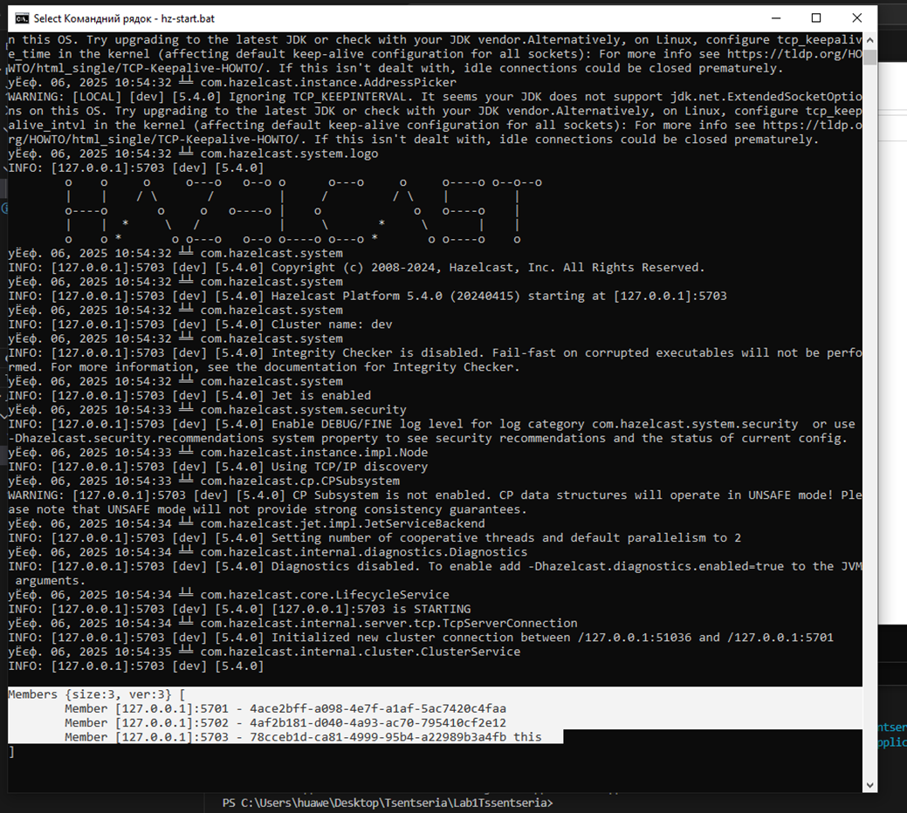

# Lab1 Реалізація каунтера з використанням Hazelcast

---

## 2) Сконфігурувати і запустити 3 ноди (інстанси)



## 3) код який буде емулювати інкремент значення для одного й того самого ключа у циклі до 10К

## 4) каунтер без блокувань

Код

```jsx
import com.hazelcast.core.Hazelcast;
import com.hazelcast.core.HazelcastInstance;
import com.hazelcast.map.IMap;

public class App {

    private static final String MAP_NAME = "likes-map";
    private static final String KEY = "likes";

    private static final int THREAD_COUNT = 10;
    private static final int INCREMENTS_PER_THREAD = 10_000;

    public static void main(String[] args) throws InterruptedException {
        HazelcastInstance hz = Hazelcast.newHazelcastInstance();

        IMap<String, Integer> map = hz.getMap(MAP_NAME);

        map.put(KEY, 0);

        System.out.println("============ START OF EXPERIMENT ============");
        System.out.println("Expected total increments for key '" + KEY + "': "
                + (THREAD_COUNT * INCREMENTS_PER_THREAD));

        long startTime = System.currentTimeMillis();

        Thread[] threads = new Thread[THREAD_COUNT];

        for (int t = 0; t < THREAD_COUNT; t++) {
            threads[t] = new Thread(() -> {
                for (int i = 0; i < INCREMENTS_PER_THREAD; i++) {
                    incrementCounterNaive(map, KEY);
                }
            });
            threads[t].start();
        }

        for (int t = 0; t < THREAD_COUNT; t++) {
            threads[t].join();
        }

        long endTime = System.currentTimeMillis();

        long expected = (long) THREAD_COUNT * INCREMENTS_PER_THREAD;
        Integer actual = map.get(KEY);

        System.out.println("=============================================");
        System.out.println("Expected value: " + expected);
        System.out.println("Actual value:   " + actual);
        System.out.println("Execution time (ms): " + (endTime - startTime));
        System.out.println("=============================================");

        hz.shutdown();
    }

    private static void incrementCounterNaive(IMap<String, Integer> map, String key) {
        Integer current = map.get(key);
        if (current == null) {
            current = 0;
        }
        Integer next = current + 1;
        map.put(key, next);
    }
}

```

Логи


- **Очікуване значення** завжди = 100000 (це 10 потоків × 10 000 циклів).
- **Фактичне значення** є **менше за 100000**.

## 5) каунтер з песимістичним блокуванням

Код

```jsx
import com.hazelcast.core.Hazelcast;
import com.hazelcast.core.HazelcastInstance;
import com.hazelcast.map.IMap;

public class App {

    private static final String MAP_NAME = "likes-map";
    private static final String KEY = "likes";

    private static final int THREAD_COUNT = 10;
    private static final int INCREMENTS_PER_THREAD = 10_000;

    public static void main(String[] args) throws InterruptedException {
        HazelcastInstance hz = Hazelcast.newHazelcastInstance();
        IMap<String, Integer> map = hz.getMap(MAP_NAME);

        map.put(KEY, 0);

        System.out.println("===== PESSIMISTIC LOCK COUNTER =====");
        System.out.println("Expected increments: " + (THREAD_COUNT * INCREMENTS_PER_THREAD)
                + " for key '" + KEY + "'");

        long startTime = System.currentTimeMillis();

        Thread[] threads = new Thread[THREAD_COUNT];

        for (int t = 0; t < THREAD_COUNT; t++) {
            threads[t] = new Thread(() -> {
                for (int i = 0; i < INCREMENTS_PER_THREAD; i++) {
                    incrementCounterWithLock(map, KEY);
                }
            });
            threads[t].start();
        }

        for (int t = 0; t < THREAD_COUNT; t++) {
            threads[t].join();
        }

        long endTime = System.currentTimeMillis();

        long expected = (long) THREAD_COUNT * INCREMENTS_PER_THREAD;
        Integer actual = map.get(KEY);

        System.out.println("====================================");
        System.out.println("Expected value: " + expected);
        System.out.println("Actual value:   " + actual);
        System.out.println("Elapsed time (ms): " + (endTime - startTime));
        System.out.println("====================================");

        hz.shutdown();
    }

    private static void incrementCounterWithLock(IMap<String, Integer> map, String key) {
        map.lock(key);
        try {
            Integer current = map.get(key);
            if (current == null) {
                current = 0;
            }
            Integer next = current + 1;
            map.put(key, next);
        } finally {
            map.unlock(key);
        }
    }
}

```

Логи


**фактичне значення** тепер має бути **рівно 100000**, але час виконання **більший** (бо потоки тепер чекають одне одного).

## **6)** каунтер з оптимістичним блокуванням

Код

```jsx
import com.hazelcast.core.Hazelcast;
import com.hazelcast.core.HazelcastInstance;
import com.hazelcast.map.IMap;

public class App {

    private static final String MAP_NAME = "likes-map";
    private static final String KEY = "likes";

    private static final int THREAD_COUNT = 10;
    private static final int INCREMENTS_PER_THREAD = 10_000;

    public static void main(String[] args) throws InterruptedException {
        HazelcastInstance hz = Hazelcast.newHazelcastInstance();
        IMap<String, Integer> map = hz.getMap(MAP_NAME);

        map.put(KEY, 0);

        System.out.println("===== OPTIMISTIC LOCK COUNTER =====");
        System.out.println("Expected increments: " + (THREAD_COUNT * INCREMENTS_PER_THREAD)
                + " for key '" + KEY + "'");

        long startTime = System.currentTimeMillis();

        Thread[] threads = new Thread[THREAD_COUNT];

        for (int t = 0; t < THREAD_COUNT; t++) {
            threads[t] = new Thread(() -> {
                for (int i = 0; i < INCREMENTS_PER_THREAD; i++) {
                    incrementCounterOptimistic(map, KEY);
                }
            });
            threads[t].start();
        }

        for (int t = 0; t < THREAD_COUNT; t++) {
            threads[t].join();
        }

        long endTime = System.currentTimeMillis();

        long expected = (long) THREAD_COUNT * INCREMENTS_PER_THREAD;
        Integer actual = map.get(KEY);

        System.out.println("===================================");
        System.out.println("Expected value: " + expected);
        System.out.println("Actual value:   " + actual);
        System.out.println("Elapsed time (ms): " + (endTime - startTime));
        System.out.println("===================================");

        hz.shutdown();
    }

    private static void incrementCounterOptimistic(IMap<String, Integer> map, String key) {
        while (true) {
            Integer current = map.get(key);
            if (current == null) {
                current = 0;
            }
            Integer next = current + 1;
            if (map.replace(key, current, next)) {
                break;
            }
        }
    }
}
```

Логи


- pessimistic: actual, але зазвичай повільніше,
- optimistic: actual, інколи швидше, ніж pessimistic, частіше повільніше

## 7) каунтер з використанням *IAtomicLong* та увімкнувши підтимку *CP Sysbsystem*

Код

```jsx
import com.hazelcast.config.Config;
import com.hazelcast.config.cp.CPSubsystemConfig;
import com.hazelcast.core.Hazelcast;
import com.hazelcast.core.HazelcastInstance;
import com.hazelcast.cp.IAtomicLong;

import java.util.concurrent.ExecutorService;
import java.util.concurrent.Executors;
import java.util.concurrent.TimeUnit;

public class App {

    private static final int THREAD_COUNT = 10;
    private static final int INCREMENTS_PER_THREAD = 10_000;

    public static void main(String[] args) throws Exception {
        Config config = new Config();
        config.setClusterName("dev");

        CPSubsystemConfig cpConfig = config.getCPSubsystemConfig();
        cpConfig.setCPMemberCount(3);
        cpConfig.setGroupSize(3);

        HazelcastInstance hz1 = Hazelcast.newHazelcastInstance(config);
        HazelcastInstance hz2 = Hazelcast.newHazelcastInstance(config);
        HazelcastInstance hz3 = Hazelcast.newHazelcastInstance(config);

        HazelcastInstance hz = hz1;

        try {
            // якщо хочеш, можеш залишити попередні завдання:
            // runCounterWithoutLock(hz);
            // runCounterWithPessimisticLock(hz);
            // runCounterWithOptimisticLock(hz);

            runAtomicLongCounter(hz);
        } finally {
            Hazelcast.shutdownAll();
        }
    }

    // сюди нижче додамо метод runAtomicLongCounter(...)

private static void runAtomicLongCounter(HazelcastInstance hz) throws InterruptedException {
    String counterName = "cpAtomicLikes";
    IAtomicLong counter = hz.getCPSubsystem().getAtomicLong(counterName);
    counter.set(0);

    ExecutorService executor = Executors.newFixedThreadPool(THREAD_COUNT);

    long startTime = System.nanoTime();

    for (int i = 0; i < THREAD_COUNT; i++) {
        executor.submit(() -> {
            for (int j = 0; j < INCREMENTS_PER_THREAD; j++) {
                counter.incrementAndGet();
            }
        });
    }

    executor.shutdown();
    executor.awaitTermination(1, TimeUnit.MINUTES);

    long durationNs = System.nanoTime() - startTime;
    long durationMs = TimeUnit.NANOSECONDS.toMillis(durationNs);

    long expected = (long) THREAD_COUNT * INCREMENTS_PER_THREAD;
    long actual = counter.get();

    System.out.println("=== IAtomicLong counter with CP Subsystem ===");
    System.out.println("Threads: " + THREAD_COUNT);
    System.out.println("Increments per thread: " + INCREMENTS_PER_THREAD);
    System.out.println("Expected value: " + expected);
    System.out.println("Actual value:   " + actual);
    System.out.println("Execution time: " + durationMs + " ms");

    counter.destroy();
}

}
```

Логи


