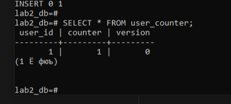

# Lab2 Реалізація каунтера з використанням PostgreSQL

---



---

## (1) Lost-update

```python
import threading
import time
import psycopg2

DB_CONFIG = {
    "host": "localhost",
    "port": 5432,
    "dbname": "lab2_db",
    "user": "postgres",
    "password": "123456",
}

NUM_THREADS = 10
INCREMENTS_PER_THREAD = 10000
USER_ID = 1

def get_connection():
    return psycopg2.connect(**DB_CONFIG)

def reset_counter():
    conn = get_connection()
    try:
        conn.autocommit = True
        cur = conn.cursor()
        cur.execute("UPDATE user_counter SET counter = 0, version = 0 WHERE user_id = %s", (USER_ID,))
        cur.close()
    finally:
        conn.close()

def lost_update_worker():
    conn = get_connection()
    try:
        conn.autocommit = False
        cur = conn.cursor()
        for _ in range(INCREMENTS_PER_THREAD):
            cur.execute("SELECT counter FROM user_counter WHERE user_id = %s", (USER_ID,))
            row = cur.fetchone()
            current = row[0]
            new_value = current + 1
            cur.execute(
                "UPDATE user_counter SET counter = %s WHERE user_id = %s",
                (new_value, USER_ID),
            )
            conn.commit()
        cur.close()
    finally:
        conn.close()

def run_lost_update():
    reset_counter()

    start = time.perf_counter()

    threads = []
    for i in range(NUM_THREADS):
        t = threading.Thread(target=lost_update_worker, name=f"worker-{i}")
        t.start()
        threads.append(t)

    for t in threads:
        t.join()

    elapsed = time.perf_counter() - start

    conn = get_connection()
    try:
        conn.autocommit = True
        cur = conn.cursor()
        cur.execute("SELECT counter FROM user_counter WHERE user_id = %s", (USER_ID,))
        final_value = cur.fetchone()[0]
        cur.close()
    finally:
        conn.close()

    expected = NUM_THREADS * INCREMENTS_PER_THREAD

    print("=== Lost-update scenario (READ COMMITTED) ===")
    print(f"Threads: {NUM_THREADS}")
    print(f"Increments per thread: {INCREMENTS_PER_THREAD}")
    print(f"Expected value: {expected}")
    print(f"Actual value:   {final_value}")
    print(f"Execution time: {elapsed:.3f} s")

if __name__ == "__main__":
    run_lost_update()

```


`Actual value` буде менше, ніж `Expected value`

**дуже швидко, але неправильно** — лічильник занижений

## (2) Serializable update

```python
import threading
import time
import random

import psycopg2
from psycopg2 import errors

DB_CONFIG = {
    "dbname": "lab2_db",
    "user": "postgres",
    "password": "123456",
    "host": "localhost",
    "port": "5432",
}

USER_ID = 1
THREADS = 10
INCREMENTS_PER_THREAD = 10000
MAX_RETRIES = 10

def init_counter():
    with psycopg2.connect(**DB_CONFIG) as conn:
        with conn.cursor() as cur:
            cur.execute(
                """
                INSERT INTO user_counter (user_id, counter, version)
                VALUES (%s, 0, 0)
                ON CONFLICT (user_id)
                DO UPDATE SET counter = EXCLUDED.counter, version = EXCLUDED.version
                """,
                (USER_ID,),
            )
        conn.commit()

def worker(thread_id: int):
    conn = psycopg2.connect(**DB_CONFIG)
    conn.set_session(isolation_level="SERIALIZABLE", autocommit=False)

    try:
        for i in range(INCREMENTS_PER_THREAD):
            retries = 0
            while True:
                try:
                    with conn.cursor() as cur:
                        cur.execute(
                            "SELECT counter FROM user_counter WHERE user_id = %s FOR UPDATE",
                            (USER_ID,),
                        )
                        row = cur.fetchone()
                        if row is None:
                            raise RuntimeError("Row for user_id not found")

                        new_value = row[0] + 1

                        cur.execute(
                            "UPDATE user_counter SET counter = %s WHERE user_id = %s",
                            (new_value, USER_ID),
                        )

                    conn.commit()
                    break
                except errors.SerializationFailure:
                    conn.rollback()
                    retries += 1
                    if retries >= MAX_RETRIES:
                        print(
                            f"Thread {thread_id}: too many retries at increment {i}"
                        )
                        break
                    backoff = 0.001 * (2 ** retries)
                    time.sleep(backoff * random.random())
    finally:
        conn.close()

def main():
    init_counter()

    start = time.perf_counter()

    threads = []
    for t_id in range(THREADS):
        t = threading.Thread(target=worker, args=(t_id,))
        t.start()
        threads.append(t)

    for t in threads:
        t.join()

    duration_ms = (time.perf_counter() - start) * 1000

    with psycopg2.connect(**DB_CONFIG) as conn:
        with conn.cursor() as cur:
            cur.execute(
                "SELECT counter FROM user_counter WHERE user_id = %s",
                (USER_ID,),
            )
            final_value = cur.fetchone()[0]

    expected = THREADS * INCREMENTS_PER_THREAD

    print("=== Serializable update (isolation level SERIALIZABLE) ===")
    print(f"Threads: {THREADS}")
    print(f"Increments per thread: {INCREMENTS_PER_THREAD}")
    print(f"Expected value: {expected}")
    print(f"Actual value:   {final_value}")
    print(f"Execution time: {duration_ms:.0f} ms")

if __name__ == "__main__":
    main()

```


- **недорахувалися** частини інкрементів.
- При цьому все працює **дуже повільно**

### Покращений код

на кожен інкремент крутить цикл `while True` і повторює транзакцію, поки вона не завершиться успішно,

```python
import threading
import time
import psycopg2
from psycopg2 import errors, extensions

DB_CONFIG = {
    "dbname": "lab2_db",
    "user": "postgres",
    "password": "123456",
    "host": "localhost",
    "port": "5432",
}

THREADS = 10
INCREMENTS_PER_THREAD = 10000

def init_counter():
    conn = psycopg2.connect(**DB_CONFIG)
    conn.autocommit = True
    cur = conn.cursor()
    cur.execute("""
        CREATE TABLE IF NOT EXISTS counter (
            id integer PRIMARY KEY,
            value integer NOT NULL
        );
    """)
    cur.execute("INSERT INTO counter (id, value) VALUES (1, 0) ON CONFLICT (id) DO UPDATE SET value = 0;")
    cur.close()
    conn.close()

def worker(thread_id: int):
    conn = psycopg2.connect(**DB_CONFIG)
    conn.set_session(isolation_level=extensions.ISOLATION_LEVEL_SERIALIZABLE, autocommit=False)
    cur = conn.cursor()

    for _ in range(INCREMENTS_PER_THREAD):
        attempts = 0
        while True:
            try:
                cur.execute("SELECT value FROM counter WHERE id = 1;")
                current_value = cur.fetchone()[0]
                cur.execute("UPDATE counter SET value = %s WHERE id = 1;", (current_value + 1,))
                conn.commit()
                break
            except errors.SerializationFailure:
                conn.rollback()
                attempts += 1
                if attempts % 20 == 0:
                    print(f"Thread {thread_id}: still retrying, attempts = {attempts}")
                time.sleep(0.01)

    cur.close()
    conn.close()

def main():
    init_counter()

    start_time = time.time()

    threads = []
    for i in range(THREADS):
        t = threading.Thread(target=worker, args=(i,))
        t.start()
        threads.append(t)

    for t in threads:
        t.join()

    conn = psycopg2.connect(**DB_CONFIG)
    cur = conn.cursor()
    cur.execute("SELECT value FROM counter WHERE id = 1;")
    final_value = cur.fetchone()[0]
    cur.close()
    conn.close()

    expected = THREADS * INCREMENTS_PER_THREAD
    elapsed = time.time() - start_time

    print("=== Serializable update with retries ===")
    print(f"Threads: {THREADS}")
    print(f"Increments per thread: {INCREMENTS_PER_THREAD}")
    print(f"Expected value: {expected}")
    print(f"Actual value:   {final_value}")
    print(f"Execution time: {elapsed:.3f} seconds")

if __name__ == "__main__":
    main()
```


ми **уникаємо lost updates**, але платимо часом

## (3) In-place update

```python
import psycopg2
import threading
import time

DB_PARAMS = {
    "dbname": "lab2_db",
    "user": "postgres",
    "password": "123456",
    "host": "localhost",
    "port": "5432",
}

THREADS = 10
INCREMENTS_PER_THREAD = 10000

def reset_counter():
    with psycopg2.connect(**DB_PARAMS) as conn:
        with conn.cursor() as cursor:
            cursor.execute(
                "UPDATE user_counter SET counter = 0, version = 0 WHERE user_id = 1;"
            )

def worker(thread_id: int):
    conn = psycopg2.connect(**DB_PARAMS)
    conn.autocommit = False
    try:
        for _ in range(INCREMENTS_PER_THREAD):
            with conn.cursor() as cursor:
                cursor.execute("BEGIN;")
                cursor.execute(
                    "UPDATE user_counter "
                    "SET counter = counter + 1 "
                    "WHERE user_id = 1;"
                )
                conn.commit()
        print(f"Thread {thread_id}: finished")
    finally:
        conn.close()

def get_counter() -> int:
    with psycopg2.connect(**DB_PARAMS) as conn:
        with conn.cursor() as cursor:
            cursor.execute(
                "SELECT counter FROM user_counter WHERE user_id = 1;"
            )
            row = cursor.fetchone()
            return row[0]

def main():
    reset_counter()

    threads = []
    start = time.time()

    for i in range(THREADS):
        t = threading.Thread(target=worker, args=(i,))
        t.start()
        threads.append(t)

    for t in threads:
        t.join()

    end = time.time()
    expected = THREADS * INCREMENTS_PER_THREAD
    actual = get_counter()

    print("=== In-place update ===")
    print(f"Threads: {THREADS}")
    print(f"Increments per thread: {INCREMENTS_PER_THREAD}")
    print(f"Expected value: {expected}")
    print(f"Actual value:   {actual}")
    print(f"Execution time: {end - start:.3f} seconds")

if __name__ == "__main__":
    main()

```


- **швидше**, ніж варіант із SERIALIZABLE-retry

## (4) Row-level locking

```python
import psycopg2
import threading
import time

DB_PARAMS = {
    "dbname": "lab2_db",
    "user": "postgres",
    "password": "123456",
    "host": "localhost",
    "port": "5432",
}

THREADS = 10
INCREMENTS_PER_THREAD = 10000

def reset_counter():
    with psycopg2.connect(**DB_PARAMS) as conn:
        with conn.cursor() as cursor:
            cursor.execute(
                "UPDATE user_counter SET counter = 0, version = 0 WHERE user_id = 1;"
            )

def worker(thread_id: int):
    conn = psycopg2.connect(**DB_PARAMS)
    conn.autocommit = False
    try:
        for _ in range(INCREMENTS_PER_THREAD):
            with conn.cursor() as cursor:
                cursor.execute("BEGIN;")
                cursor.execute(
                    "SELECT counter FROM user_counter "
                    "WHERE user_id = 1 "
                    "FOR UPDATE;"
                )
                current = cursor.fetchone()[0]
                new_value = current + 1
                cursor.execute(
                    "UPDATE user_counter SET counter = %s WHERE user_id = 1;",
                    (new_value,),
                )
                conn.commit()
        print(f"Thread {thread_id}: finished")
    finally:
        conn.close()

def get_counter() -> int:
    with psycopg2.connect(**DB_PARAMS) as conn:
        with conn.cursor() as cursor:
            cursor.execute(
                "SELECT counter FROM user_counter WHERE user_id = 1;"
            )
            row = cursor.fetchone()
            return row[0]

def main():
    reset_counter()

    threads = []
    start = time.time()

    for i in range(THREADS):
        t = threading.Thread(target=worker, args=(i,))
        t.start()
        threads.append(t)

    for t in threads:
        t.join()

    end = time.time()
    expected = THREADS * INCREMENTS_PER_THREAD
    actual = get_counter()

    print("=== Row-level locking (SELECT ... FOR UPDATE) ===")
    print(f"Threads: {THREADS}")
    print(f"Increments per thread: {INCREMENTS_PER_THREAD}")
    print(f"Expected value: {expected}")
    print(f"Actual value:   {actual}")
    print(f"Execution time: {end - start:.3f} seconds")

if __name__ == "__main__":
    main()

```


правильно

## (5) Optimistic concurrency control

```python
import threading
import time
import psycopg2

DB_PARAMS = {
    "dbname": "lab2_db",
    "user": "postgres",
    "password": "123456",
    "host": "localhost",
    "port": "5432",
}

THREADS = 10
INCREMENTS_PER_THREAD = 10000

def reset_counter():
    conn = psycopg2.connect(**DB_PARAMS)
    conn.autocommit = True
    try:
        with conn.cursor() as cursor:
            cursor.execute("UPDATE user_counter SET counter = 0, version = 0 WHERE user_id = 1;")
    finally:
        conn.close()

def get_counter():
    conn = psycopg2.connect(**DB_PARAMS)
    try:
        with conn.cursor() as cursor:
            cursor.execute("SELECT counter FROM user_counter WHERE user_id = 1;")
            row = cursor.fetchone()
            return row[0] if row else None
    finally:
        conn.close()

def worker(thread_id: int):
    conn = psycopg2.connect(**DB_PARAMS)
    conn.autocommit = False
    try:
        for _ in range(INCREMENTS_PER_THREAD):
            success = False
            while not success:
                try:
                    with conn.cursor() as cursor:
                        cursor.execute(
                            "SELECT counter, version "
                            "FROM user_counter "
                            "WHERE user_id = 1;"
                        )
                        row = cursor.fetchone()
                        if row is None:
                            conn.rollback()
                            return
                        current = row[0]
                        version = row[1]
                        new_counter = current + 1
                        new_version = version + 1
                        cursor.execute(
                            "UPDATE user_counter "
                            "SET counter = %s, version = %s "
                            "WHERE user_id = %s AND version = %s;",
                            (new_counter, new_version, 1, version),
                        )
                        if cursor.rowcount == 1:
                            conn.commit()
                            success = True
                        else:
                            conn.rollback()
                except psycopg2.Error:
                    conn.rollback()
                if not success:
                    time.sleep(0.001)
        print(f"Thread {thread_id}: finished")
    finally:
        conn.close()

def main():
    reset_counter()

    threads = []
    start = time.time()
    for i in range(THREADS):
        t = threading.Thread(target=worker, args=(i,))
        t.start()
        threads.append(t)

    for t in threads:
        t.join()
    end = time.time()

    expected = THREADS * INCREMENTS_PER_THREAD
    actual = get_counter()

    print("=== Optimistic concurrency control ===")
    print(f"Threads: {THREADS}")
    print(f"Increments per thread: {INCREMENTS_PER_THREAD}")
    print(f"Expected value: {expected}")
    print(f"Actual value:   {actual}")
    print(f"Execution time: {end - start:.3f} seconds")

if __name__ == "__main__":
    main()

```


**правильно, якщо не обмежувати кількість повторів**, але при великій конкуренції час може бути суттєвий