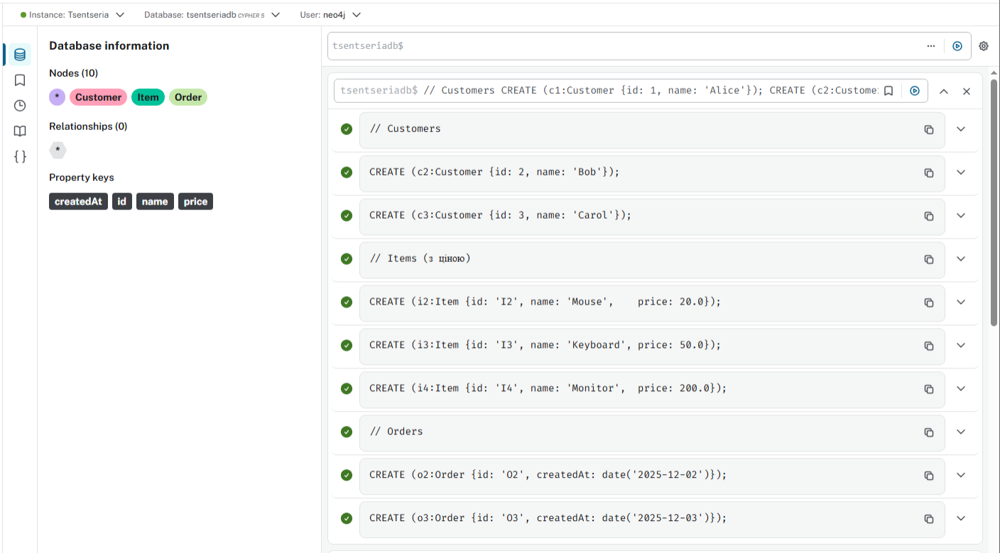

# Lab3 Робота з базовими функціями граф-орієнтованої БД на прикладі Neo4j

# Модель даних (яку будемо реалізовувати)

## Вводимо такі типи вузлів та зв’язків:

- Вузли:
    - `(:Customer {id, name, ...})`
    - `(:Item {id, name, price, likes?})`
    - `(:Order {id, createdAt, ...})`
- Зв’язки:
    - Покупка:
        - `(:Customer)-[:PLACED]->(:Order)`
        - `(:Order)-[:CONTAINS]->(:Item)`
    - Перегляд без покупки:
        - `(:Customer)-[:VIEWED]->(:Item)`

# Створення Customers, Items, Orders, зв’язків

```python
// Очистити базу (якщо потрібно)
MATCH (n)
DETACH DELETE n;

// Customers
CREATE (c1:Customer {id: 1, name: 'Alice'});
CREATE (c2:Customer {id: 2, name: 'Bob'});
CREATE (c3:Customer {id: 3, name: 'Carol'});

// Items (з ціною)
CREATE (i1:Item {id: 'I1', name: 'Laptop',   price: 1000.0});
CREATE (i2:Item {id: 'I2', name: 'Mouse',    price: 20.0});
CREATE (i3:Item {id: 'I3', name: 'Keyboard', price: 50.0});
CREATE (i4:Item {id: 'I4', name: 'Monitor',  price: 200.0});

// Orders
CREATE (o1:Order {id: 'O1', createdAt: date('2025-12-01')});
CREATE (o2:Order {id: 'O2', createdAt: date('2025-12-02')});
CREATE (o3:Order {id: 'O3', createdAt: date('2025-12-03')});

// Зв’язки: хто зробив який Order
MATCH (c1:Customer {id: 1}), (o1:Order {id: 'O1'})
CREATE (c1)-[:PLACED]->(o1);

MATCH (c1:Customer {id: 1}), (o2:Order {id: 'O2'})
CREATE (c1)-[:PLACED]->(o2);

MATCH (c2:Customer {id: 2}), (o3:Order {id: 'O3'})
CREATE (c2)-[:PLACED]->(o3);

// Зв’язки: які Items входять в Orders
MATCH (o1:Order {id: 'O1'}), (i1:Item {id: 'I1'})
CREATE (o1)-[:CONTAINS]->(i1);

MATCH (o1:Order {id: 'O1'}), (i2:Item {id: 'I2'})
CREATE (o1)-[:CONTAINS]->(i2);

MATCH (o2:Order {id: 'O2'}), (i2:Item {id: 'I2'})
CREATE (o2)-[:CONTAINS]->(i2);

MATCH (o2:Order {id: 'O2'}), (i3:Item {id: 'I3'})
CREATE (o2)-[:CONTAINS]->(i3);

MATCH (o3:Order {id: 'O3'}), (i3:Item {id: 'I3'})
CREATE (o3)-[:CONTAINS]->(i3);

MATCH (o3:Order {id: 'O3'}), (i4:Item {id: 'I4'})
CREATE (o3)-[:CONTAINS]->(i4);

// Перегляди (VIEWED), не всі з них — покупки
MATCH (c1:Customer {id: 1}), (i4:Item {id: 'I4'})
CREATE (c1)-[:VIEWED]->(i4);

MATCH (c1:Customer {id: 1}), (i2:Item {id: 'I2'})
CREATE (c1)-[:VIEWED]->(i2);

MATCH (c2:Customer {id: 2}), (i1:Item {id: 'I1'})
CREATE (c2)-[:VIEWED]->(i1);

MATCH (c3:Customer {id: 3}), (i1:Item {id: 'I1'})
CREATE (c3)-[:VIEWED]->(i1);

MATCH (c3:Customer {id: 3}), (i2:Item {id: 'I2'})
CREATE (c3)-[:VIEWED]->(i2);
```




### Перевіряємо створення


---

# Написати наступні види запитів:

- Знайти Items які входять в конкретний Order


- Підрахувати вартість конкретного Order


- Знайти всі Orders конкретного Customer


- Знайти всі Items куплені конкретним Customer (через Order)


- Знайти кількість Items куплені конкретним Customer (через Order)


- Знайти для Customer на яку суму він придбав товарів (через Order)


- Знайті скільки разів кожен товар був придбаний, відсортувати за цим значенням


- Знайти всі Items переглянуті (view) конкретним Customer


- Знайти інші Items що купувались разом з конкретним Item (тобто всі Items що входять до Order-s разом з даними Item)


- Знайти Customers які купили даний конкретний Item


- Знайти для певного Customer(а) товари, які він переглядав, але не купив


---

# Як і в попередніх завданнях, для якогось одного обраного Item додайте поле з кількістю його лайків.

MATCH (i:Item {id: "I1"})
SET i.likes = 0
RETURN [i.id](http://i.id/) AS itemId, [i.name](http://i.name/) AS itemName, i.likes AS likes;


```python
from neo4j import GraphDatabase
import threading
import time

NEO4J_URI = "bolt://localhost:7687"
NEO4J_USER = "neo4j"
NEO4J_PASSWORD = "12345678"

ITEM_ID = "I1"              # обраний товар
NUM_CLIENTS = 10            # кількість "клієнтів"
INCREMENTS_PER_CLIENT = 10000  # інкрементів від кожного клієнта

driver = GraphDatabase.driver(NEO4J_URI, auth=(NEO4J_USER, NEO4J_PASSWORD))

def reset_likes():
    with driver.session(database="tsentseriadb") as session:
        session.run(
            """
            MATCH (i:Item {id: $item_id})
            SET i.likes = 0
            RETURN i.likes
            """,
            item_id=ITEM_ID,
        )

def increment_likes(item_id):
    with driver.session(database="tsentseriadb") as session:
        for _ in range(INCREMENTS_PER_CLIENT):
            session.run(
                """
                MATCH (i:Item {id: $item_id})
                SET i.likes = coalesce(i.likes, 0) + 1
                RETURN i.likes
                """,
                item_id=item_id,
            ).consume()

def get_likes():
    with driver.session(database="tsentseriadb") as session:
        record = session.run(
            """
            MATCH (i:Item {id: $item_id})
            RETURN i.likes AS likes
            """,
            item_id=ITEM_ID,
        ).single()
        return record["likes"]

def main():
    reset_likes()

    start = time.perf_counter()

    threads = []
    for client_id in range(NUM_CLIENTS):
        t = threading.Thread(target=increment_likes, args=(ITEM_ID,))
        threads.append(t)
        t.start()

    for t in threads:
        t.join()

    end = time.perf_counter()

    expected = NUM_CLIENTS * INCREMENTS_PER_CLIENT
    actual = get_likes()
    elapsed = end - start

    print("=== Likes counter with Neo4j ===")
    print(f"Item ID:               {ITEM_ID}")
    print(f"Clients:               {NUM_CLIENTS}")
    print(f"Increments per client: {INCREMENTS_PER_CLIENT}")
    print(f"Expected likes:        {expected}")
    print(f"Actual likes:          {actual}")
    print(f"Execution time:        {elapsed:.3f} seconds")

if __name__ == "__main__":
    main()
    driver.close()
```


Neo4j забезпечує серіалізацію записів до одного й того ж вузла за допомогою блокувань, і фактичне значення дорівнює очікуваному `100000`.