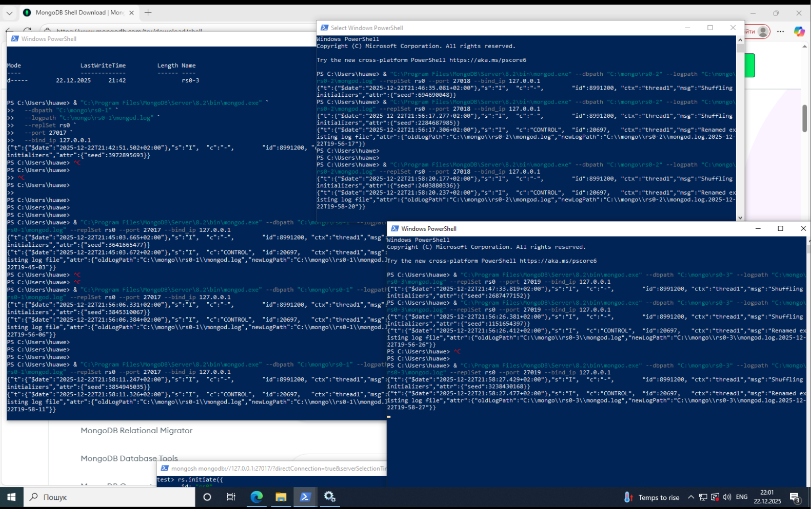

# Task 4 - Налаштування реплікації та перевірка відмовостійкості MongoDB

# Запуск трьох `mongod` (Replica Set P-S-S)

**3 процеси MongoDB** на різних портах:



---

# 1. Налаштувати реплікацію в конфігурації: Primary with Two Secondary Members (P-S-S)

## ініціалізація Replica Set через mongosh


## Перевіримо:

- один member → `"stateStr" : "PRIMARY"`
- два members → `"stateStr" : "SECONDARY"`

```powershell
rs0 [direct: secondary] test> rs.status()
{
  set: 'rs0',
  date: ISODate('2025-12-22T20:06:30.242Z'),
  myState: 1,
  term: Long('1'),
  syncSourceHost: '',
  syncSourceId: -1,
  heartbeatIntervalMillis: Long('2000'),
  majorityVoteCount: 2,
  writeMajorityCount: 2,
  votingMembersCount: 3,
  writableVotingMembersCount: 3,
  optimes: {
    lastCommittedOpTime: { ts: Timestamp({ t: 1766433988, i: 1 }), t: Long('1') },
    lastCommittedWallTime: ISODate('2025-12-22T20:06:28.546Z'),
    readConcernMajorityOpTime: { ts: Timestamp({ t: 1766433988, i: 1 }), t: Long('1') },
    appliedOpTime: { ts: Timestamp({ t: 1766433988, i: 1 }), t: Long('1') },
    durableOpTime: { ts: Timestamp({ t: 1766433988, i: 1 }), t: Long('1') },
    writtenOpTime: { ts: Timestamp({ t: 1766433988, i: 1 }), t: Long('1') },
    lastAppliedWallTime: ISODate('2025-12-22T20:06:28.546Z'),
    lastDurableWallTime: ISODate('2025-12-22T20:06:28.546Z'),
    lastWrittenWallTime: ISODate('2025-12-22T20:06:28.546Z')
  },
  lastStableRecoveryTimestamp: Timestamp({ t: 1766433948, i: 1 }),
  electionCandidateMetrics: {
    lastElectionReason: 'electionTimeout',
    lastElectionDate: ISODate('2025-12-22T19:59:08.022Z'),
    electionTerm: Long('1'),
    lastCommittedOpTimeAtElection: { ts: Timestamp({ t: 1766433537, i: 1 }), t: Long('-1') },
    lastSeenWrittenOpTimeAtElection: { ts: Timestamp({ t: 1766433537, i: 1 }), t: Long('-1') },
    lastSeenOpTimeAtElection: { ts: Timestamp({ t: 1766433537, i: 1 }), t: Long('-1') },
    numVotesNeeded: 2,
    priorityAtElection: 1,
    electionTimeoutMillis: Long('10000'),
    numCatchUpOps: Long('0'),
    newTermStartDate: ISODate('2025-12-22T19:59:08.205Z'),
    wMajorityWriteAvailabilityDate: ISODate('2025-12-22T19:59:08.696Z')
  },
  members: [
    {
      _id: 0,
      name: '127.0.0.1:27017',
      health: 1,
      state: 1,
      **stateStr: 'PRIMARY',**
      uptime: 499,
      optime: { ts: Timestamp({ t: 1766433988, i: 1 }), t: Long('1') },
      optimeDate: ISODate('2025-12-22T20:06:28.000Z'),
      optimeWritten: { ts: Timestamp({ t: 1766433988, i: 1 }), t: Long('1') },
      optimeWrittenDate: ISODate('2025-12-22T20:06:28.000Z'),
      lastAppliedWallTime: ISODate('2025-12-22T20:06:28.546Z'),
      lastDurableWallTime: ISODate('2025-12-22T20:06:28.546Z'),
      lastWrittenWallTime: ISODate('2025-12-22T20:06:28.546Z'),
      syncSourceHost: '',
      syncSourceId: -1,
      infoMessage: '',
      electionTime: Timestamp({ t: 1766433548, i: 1 }),
      electionDate: ISODate('2025-12-22T19:59:08.000Z'),
      configVersion: 1,
      configTerm: 1,
      self: true,
      lastHeartbeatMessage: ''
    },
    {
      _id: 1,
      name: '127.0.0.1:27018',
      health: 1,
      state: 2,
      **stateStr: 'SECONDARY',**
      uptime: 453,
      optime: { ts: Timestamp({ t: 1766433988, i: 1 }), t: Long('1') },
      optimeDurable: { ts: Timestamp({ t: 1766433988, i: 1 }), t: Long('1') },
      optimeWritten: { ts: Timestamp({ t: 1766433988, i: 1 }), t: Long('1') },
      optimeDate: ISODate('2025-12-22T20:06:28.000Z'),
      optimeDurableDate: ISODate('2025-12-22T20:06:28.000Z'),
      optimeWrittenDate: ISODate('2025-12-22T20:06:28.000Z'),
      lastAppliedWallTime: ISODate('2025-12-22T20:06:28.546Z'),
      lastDurableWallTime: ISODate('2025-12-22T20:06:28.546Z'),
      lastWrittenWallTime: ISODate('2025-12-22T20:06:28.546Z'),
      lastHeartbeat: ISODate('2025-12-22T20:06:29.246Z'),
      lastHeartbeatRecv: ISODate('2025-12-22T20:06:28.385Z'),
      pingMs: Long('0'),
      lastHeartbeatMessage: '',
      syncSourceHost: '127.0.0.1:27017',
      syncSourceId: 0,
      infoMessage: '',
      configVersion: 1,
      configTerm: 1
    },
    {
      _id: 2,
      name: '127.0.0.1:27019',
      health: 1,
      state: 2,
      **stateStr: 'SECONDARY',**
      uptime: 453,
      optime: { ts: Timestamp({ t: 1766433988, i: 1 }), t: Long('1') },
      optimeDurable: { ts: Timestamp({ t: 1766433988, i: 1 }), t: Long('1') },
      optimeWritten: { ts: Timestamp({ t: 1766433988, i: 1 }), t: Long('1') },
      optimeDate: ISODate('2025-12-22T20:06:28.000Z'),
      optimeDurableDate: ISODate('2025-12-22T20:06:28.000Z'),
      optimeWrittenDate: ISODate('2025-12-22T20:06:28.000Z'),
      lastAppliedWallTime: ISODate('2025-12-22T20:06:28.546Z'),
      lastDurableWallTime: ISODate('2025-12-22T20:06:28.546Z'),
      lastWrittenWallTime: ISODate('2025-12-22T20:06:28.546Z'),
      lastHeartbeat: ISODate('2025-12-22T20:06:29.247Z'),
      lastHeartbeatRecv: ISODate('2025-12-22T20:06:29.722Z'),
      pingMs: Long('0'),
      lastHeartbeatMessage: '',
      syncSourceHost: '127.0.0.1:27017',
      syncSourceId: 0,
      infoMessage: '',
      configVersion: 1,
      configTerm: 1
    }
  ],
  ok: 1,
  '$clusterTime': {
    clusterTime: Timestamp({ t: 1766433988, i: 1 }),
    signature: {
      hash: Binary.createFromBase64('AAAAAAAAAAAAAAAAAAAAAAAAAAA=', 0),
      keyId: Long('0')
    }
  },
  operationTime: Timestamp({ t: 1766433988, i: 1 })
}
rs0 [direct: primary] test>
```


# 2. Спробувати зробити запис з однією відключеною нодою та *write concern* рівнім 3 та нескінченім таймаутом. Спробувати під час таймаута включити відключену ноду

Підготовка тестової колекції


**Запис з `writeConcern: 3` і БЕЗ таймауту відпрацював нормально**


## Вимикаємо одну Secondary

**Запис з `writeConcern: 3` і БЕЗ таймауту**


- Команда **зависла**
- MongoDB **чекає третю ноду**

## УВІМКНЕННЯ ноди назад

**команда завершилась**


# 3. Аналогічно попередньому пункту, але задати скінченний таймаут та дочекатись його закінчення. Перевірити чи данні записались і чи доступні на читання з рівнем *readConcern: “majority”*

### **з таймаутом**

Через ~3 секунди отримуємо помилку


### Читання з majority

**тільки підтверджені більшістю записи**.


# 4. Продемонстрував перевибори primary node відключивши поточний primary (Replica Set Elections)

### До падіння

```
  name: '127.0.0.1:27017',
  health: 1,
  state: 1,
  stateStr: 'PRIMARY',

```


## Перевибори

- один із SECONDARY стає:
    
    ```
    "stateStr":"PRIMARY"
    
    ```
    


- старий PRIMARY:
    
    ```
    "stateStr":"(not reachable/healthy)"
    
    ```
    


### Перевірка, що записи ПРОДОВЖУЮТЬ працювати:


## ПОВЕРНЕННЯ старої PRIMARY

- відновлена нода → `"stateStr": "SECONDARY"`
- **вона НЕ стане primary назад автоматично**


## • після відновлення роботи старої primary на неї реплікуються нові дані, які з'явилися під час її простою


---

---

---

# Вказавши у парметрах *findOneAndUpdate writeConcern = 1* (це буде означати, що запис іде тільки на Primary ноду і не чекає відповіді від Secondary), запустіть 10 клієнтів з інкрементом по 10_000 на кожному з них. Виміряйте час виконання та перевірте чи кінцеве значення буде дорівнювати очікуваному - 100К


`findOneAndUpdate()` не дає lost updates

## writeConcern = 1

```python
from pymongo import MongoClient
from concurrent.futures import ThreadPoolExecutor
import time

URI = "mongodb://127.0.0.1:27017,127.0.0.1:27018,127.0.0.1:27019/?replicaSet=rs0&retryWrites=true"

def worker():
    client = MongoClient(URI, w=1)
    db = client.lab4db
    for _ in range(10000):
        db.likes.find_one_and_update(
            {"_id": "item1"},
            {"$inc": {"likes": 1}}
        )
    client.close()

def main():
    start = time.time()

    with ThreadPoolExecutor(max_workers=10) as executor:
        for _ in range(10):
            executor.submit(worker)

    duration = time.time() - start

    client = MongoClient(URI)
    result = client.lab4db.likes.find_one({"_id": "item1"})
    client.close()

    print("WriteConcern = 1")
    print("Expected value: 100000")
    print("Actual value:", result["likes"])
    print("Execution time (seconds):", round(duration, 2))

if __name__ == "__main__":
    main()
```


- час 168.93
- значення **100000 як і очікуване значення**

# Вказавши у парметрах *findOneAndUpdate writeConcern = majority* (це буде означати, що Primary чекає поки значення запишется на більшість нод), запустіть 10 клієнтів з інкрементом по 10_000 на кожному з них. Виміряйте час виконання та перевірте чи кінцеве значення буде дорівнювати очікуваному - 100К

## writeConcern = majority

```python
from pymongo import MongoClient
from concurrent.futures import ThreadPoolExecutor
import time

URI = "mongodb://127.0.0.1:27017,127.0.0.1:27018,127.0.0.1:27019/?replicaSet=rs0&retryWrites=true"

def worker():
    client = MongoClient(URI, w="majority")
    db = client.lab4db
    for _ in range(10000):
        db.likes.find_one_and_update(
            {"_id": "item1"},
            {"$inc": {"likes": 1}}
        )
    client.close()

def main():
    start = time.time()

    with ThreadPoolExecutor(max_workers=10) as executor:
        for _ in range(10):
            executor.submit(worker)

    duration = time.time() - start

    client = MongoClient(URI)
    result = client.lab4db.likes.find_one({"_id": "item1"})
    client.close()

    print("WriteConcern = majority")
    print("Expected value: 100000")
    print("Actual value:", result["likes"])
    print("Execution time (seconds):", round(duration, 2))

if __name__ == "__main__":
    main()
```


- час **повільніший чим при** writeConcern = 1
- значення **100000 як і очікуване значення**

# Повторно запустить код при *writeConcern = 1*, але тепер під час роботи відключіть Primary ноду і подивитись що буде обрана інша Primary нода, яка продовжить обробку запитів, і чи кінцевий результат буде коректним.

При *writeConcern = 1* деякі записи можуть губитись під час раптового відключення. 


# Повторно запустить код при *writeConcern = majority*, але тепер під час роботи відключіть Primary ноду і подивитись що буде обрана інша Primary нода, яка продовжить обробку запитів, і чи кінцевий результат буде коректним.

При *writeConcern = majority* має виходити очікуваний результат.


---

## writeConcern=1 швидший, але небезпечний

## writeConcern=majority повільніший, але надійний
